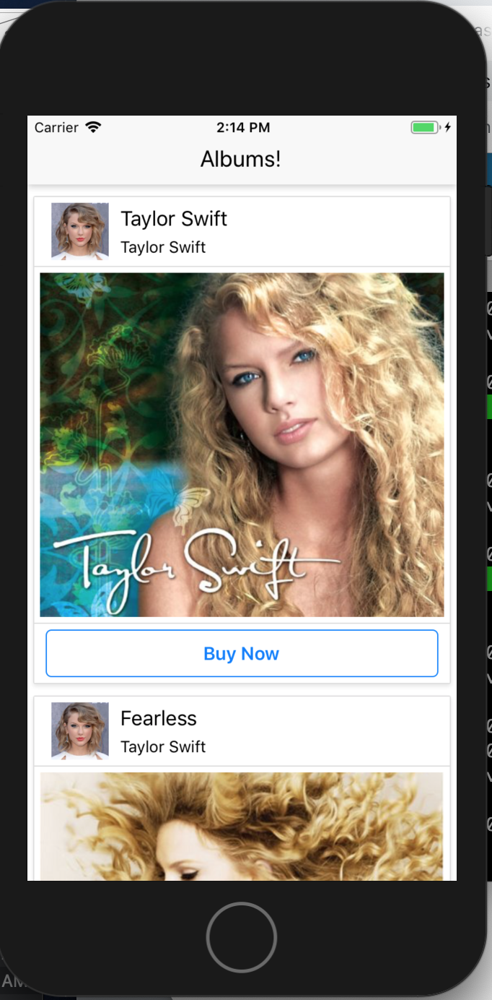
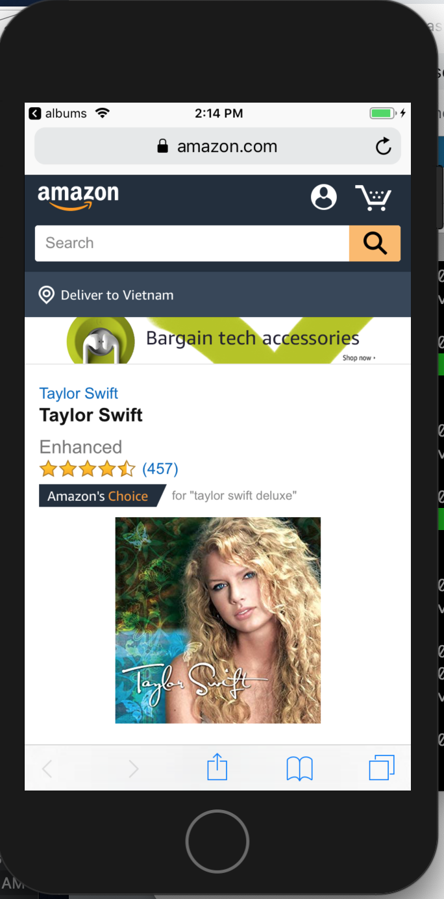

# react-native-albums

App created to allow users to view Taylor Swift albums fetching from an API. This was created in a React Native Udemy Course by Stephen Grider.

To run the program:

1.  clone repo and run npm install

2.  To run on iphone: react-native run-ios
    To run on android: react-native run-android

Main page with scrollable list of albums:

Page once click on buy now/ routes to amazon link

